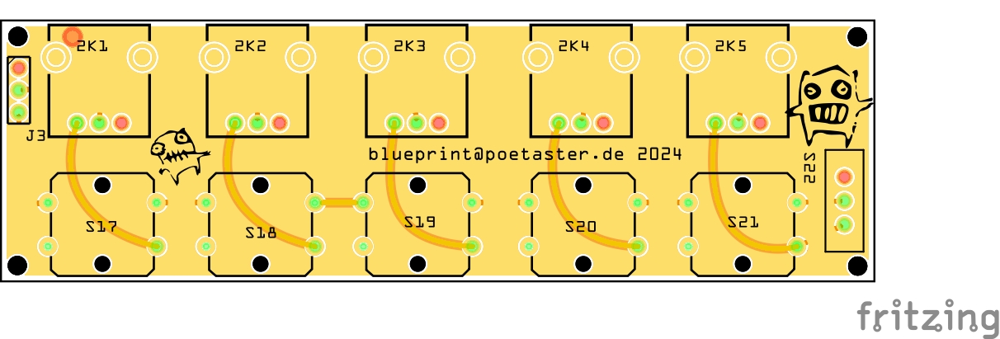
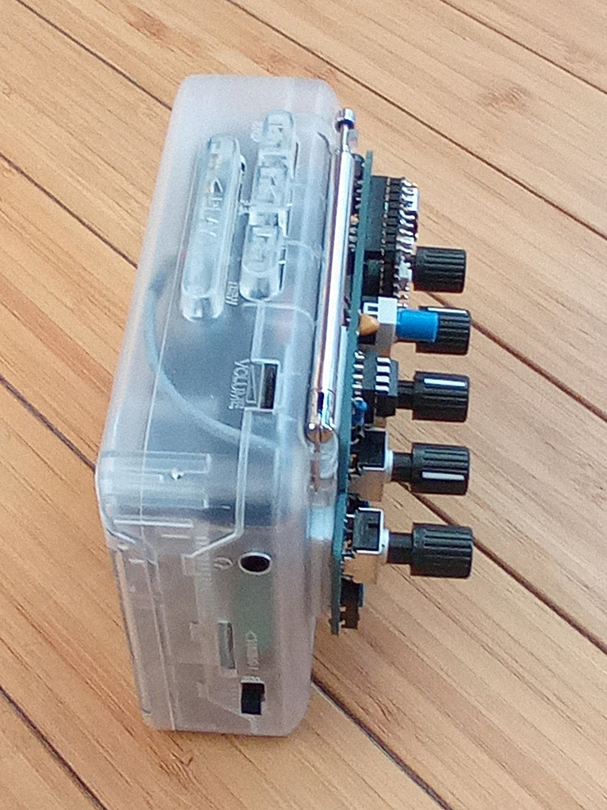
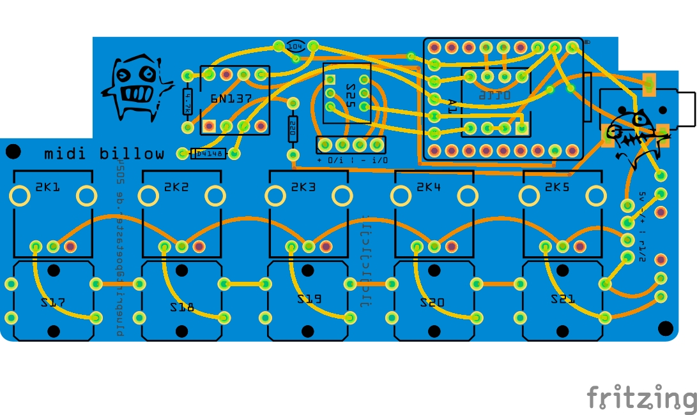

# billow and midi billow
These are the design files (fritzing) for the billow micro mellotron made for tonetoys

The design for plain billow is billow.01.fzz and the midi billow billow.b.fzz

Billow is very simple :) Take a tape player, remove the speed fine adjust trim pot (usually about 2k), replace with the following :

The gerbers directory in this repository contains all the files you need to have a pcb house make pcbs for you. Generally, you just 'zip' the directory and upload.

## Midi Billow

I sell built versions on https://tonetoys.etsy.com and Tindie.

Billow and midi billow are open hardware released under the gplv3. 

You can make your own or sell it, but if you do sell versions, you must release the source publicly so we can benefit!

Still, it's all simple enough :)
